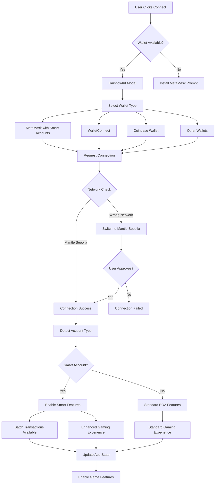
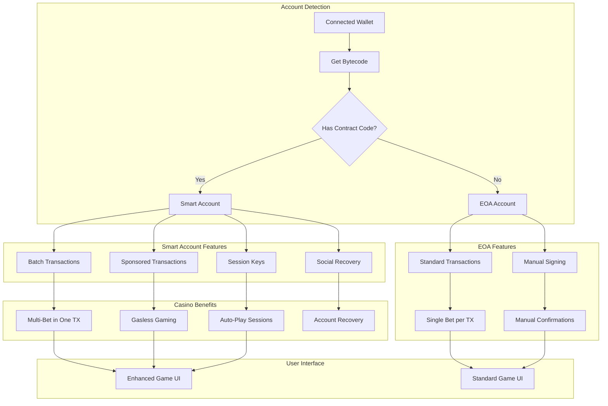
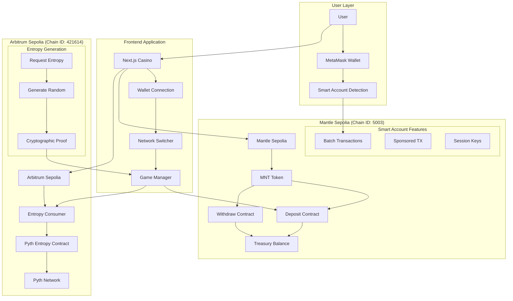
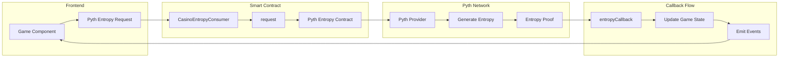
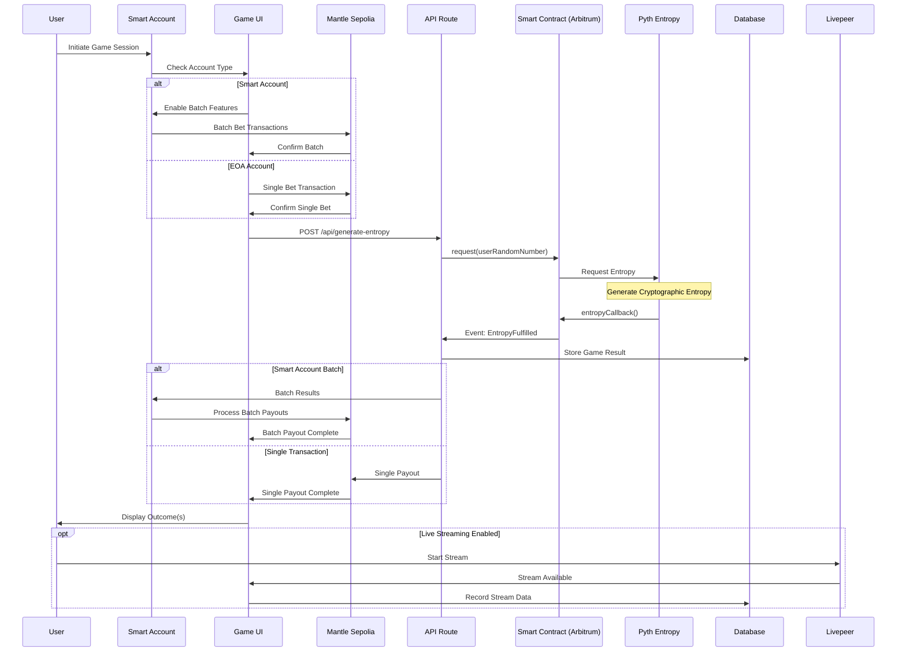
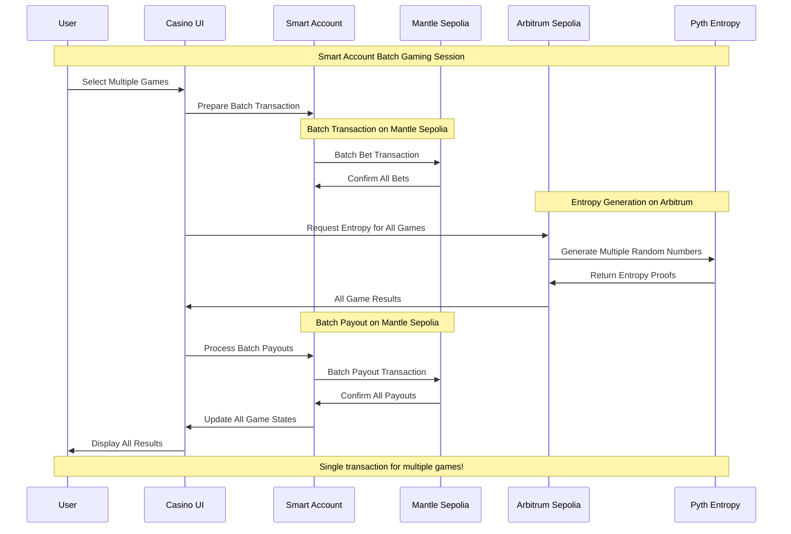

# 🎮 APT-Casino: A Fully On-Chain, Provably-Fair Casino 

A couple of days back, I was was on etherscan exploring some transactions and saw an advertisement of https://stake.com/ which was giving 200% bonus on first deposit, I deposited 120 USDT into stake.com they gave 360 USDT as total balance in their controlled custodial wallet and when I started playing casino games I was shocked to see that I was only able to play with $1 per game and was unable to increase the betting amount beyond $1 and when I tried to explore and play other games on the platform the issue was persisting, I reached the customer support and got to know that this platform has cheated me under the name of wager limits as I was using the bonus scheme of 200%.

When I asked the customer support for refund they showed a mathematical equation which says if refund then I have to play $12,300 worth of gameplay and this was a big shock for me. Thereby, In the hope of getting the deposited money back, I played the different games of stake.com like roulette, mines, spin wheel, etc, the entire night and lost all the money and time.

I was very annoyed of that's how Apt-Casino was born, gamblefi all in one platform where new web3 users can play games, perform gambling but have a safe, secure, transparent environment that does not scam any of their users. Also, I wanted to address common issues in traditional gambling platforms.

## 🎯 The Problem

The traditional online gambling industry suffers from several issues:

- **Unfair Game Outcomes**: 99% of platforms manipulate game results, leading to unfair play
- **High Fees**: Exorbitant charges for deposits, withdrawals, and gameplay
- **Restrictive Withdrawal Policies**: Conditions that prevent users from accessing their funds
- **Misleading Bonus Schemes**: Trapping users with unrealistic wagering requirements
- **Lack of True Asset Ownership**: Centralized control over user funds
- **User Adoption Barriers**: Complexity of using wallets creates friction for web2 users
- **No Social Layer**: Lack of live streaming, community chat, and collaborative experiences

## 💡 Our Solution

APT Casino addresses these problems by offering:
- **Provably Fair Gaming**: All game outcomes are verifiably fair on-chain, not only by its developers but can be verified by the gambler themselves.


- **Multiple Games**: Wheel, Roulette, Plinko, and Mines with verifiable outcomes
- **MetaMask Smart Accounts**: Enhanced wallet experience with batch transactions
- **Flexible Withdrawal**: Unrestricted access to funds
- **Transparent Bonuses**: Clear terms without hidden traps
- **True Asset Ownership**: Decentralized asset management
- **Live Streaming Integration**: Built with Livepeer, enabling real-time game streams and tournaments
- **On-Chain Chat**: Supabase + Socket.IO with wallet-signed messages for verifiable player communication
- **Gasless Gaming Experience**: Treasury-sponsored transactions for seamless web2-like experience

## 🌟 Key Features

### 1. Smart Account Integration

- **Batch Transactions**: Multiple bets in one transaction
- **Delegated Gaming**: Authorise AI agent strategies to play on your behalf
- **Lower Gas Costs**: Optimized for frequent players
- **Enhanced Security**: Smart contract-based accounts

### 2. Provably Fair Gaming


- **Pyth Entropy**: Cryptographically secure randomness
- **On-Chain Verification**: All game outcomes verifiable
- **Transparent Mechanics**: Open-source game logic

### 3. Multi-Chain Architecture

- **Gaming Network**: Mantle Sepolia Testnet (Chain ID: 5003)
- **Entropy Network**: Arbitrum Sepolia (Chain ID: 421614)

### 4. Game Selection

- **Roulette**: European roulette with Smart Account batch betting
- **Mines**: Strategic mine-sweeping with delegated pattern betting
- **Plinko**: Physics-based ball drop with auto-betting features
- **Wheel**: Classic spinning wheel with multiple risk levels

### 5. Social Features

- **Live Streaming**: Integrated with Livepeer for real-time game streams and tournaments
- **On-Chain Chat**: Real-time communication with wallet-signed messages
- **Player Profiles**: NFT-based profiles with gaming history and achievements
- **Community Events**: Tournaments and collaborative gaming experiences

### 6. Web2 User Experience

- **Gasless Transactions**: Treasury-sponsored transactions eliminate gas fees
- **Seamless Onboarding**: Simplified wallet experience for web2 users
- **Familiar Interface**: Web2-like experience with web3 benefits

## 🚀 Getting Started

1. **Connect Wallet**: Connect your MetaMask wallet to Mantle Sepolia Testnet
2. **Get Tokens**: Get MNT tokens from the Mantle Sepolia faucet
3. **Deposit**: Deposit MNT to your APT-Casino wallet balance
4. **Play**: Start playing provably fair games without any txn confirmation requirement!

### Network Configuration

#### Mantle Sepolia Testnet (Primary Network)
Add Mantle Sepolia Testnet to MetaMask:
- **Network Name**: Mantle Sepolia Testnet
- **RPC URL**: `https://rpc.sepolia.mantle.xyz`
- **Chain ID**: `5003`
- **Currency Symbol**: `MNT`
- **Block Explorer**: `https://sepolia.mantlescan.xyz`

#### Arbitrum Sepolia Testnet (Entropy Network)
The application also uses Arbitrum Sepolia for Pyth Entropy randomness:
- **Network Name**: Arbitrum Sepolia
- **RPC URL**: `https://sepolia-rollup.arbitrum.io/rpc`
- **Chain ID**: `421614`
- **Currency Symbol**: `ETH`
- **Block Explorer**: `https://sepolia.arbiscan.io`

**Note:** Users only need to connect to Mantle Sepolia. The application handles Arbitrum Sepolia operations automatically in the background.

### Quick Setup

```bash
# Clone the repository
git clone <repository-url>
cd apt-casino

# Install dependencies
npm install

# Set up environment variables
# Create a .env file in the root directory
# Copy the environment variables from the "Environment Variables" section below
# ⚠️ IMPORTANT: Never commit your .env file to version control!

# Run development server
npm run dev
```

Visit `http://localhost:3000` to see the application.

**Note:** Make sure to configure all required environment variables in your `.env` file before running the application. See the [Environment Variables](#environment-variables) section for the complete configuration.

## 🔷 Smart Account Features

APT Casino leverages MetaMask Smart Accounts for an enhanced gaming experience:

### Delegation Benefits:
- **Auto-Betting Strategies**: Delegate betting permissions to strategy contracts
- **Batch Gaming Sessions**: Play multiple games in a single transaction
- **Session-Based Gaming**: Set time-limited permissions for continuous play
- **Gasless Gaming**: Sponsored transactions for smoother experience

### Usage:
```javascript
// Create a delegation for auto-betting
const createAutoBetDelegation = async (maxBet, timeLimit, gameTypes) => {
  return delegationRegistry.createDelegation({
    delegatee: strategyContract,
    constraints: {
      maxAmount: maxBet,
      validUntil: timeLimit,
      allowedGames: gameTypes
    }
  });
};

// Execute batch bets through delegation
const executeBatchBets = async (bets) => {
  return delegationRegistry.executeDelegatedTransactions({
    delegationId,
    transactions: bets.map(bet => ({
      to: bet.gameContract,
      data: bet.data,
      value: bet.amount
    }))
  });
};
```

## 🔗 Wallet Connection & Smart Account Flow



## 🔷 Smart Account Detection & Features



## 🌐 Multi-Network Architecture (Mantle Sepolia + Arbitrum)



## 🎲 Pyth Entropy Integration Architecture



## 🎮 Game Execution Flow (Smart Account Enhanced)



## 🔄 Smart Account Transaction Flow



## 🔮 Future Roadmap

- **Mainnet Launch**: Deploying on Mantle mainnet for real-world use
- **Additional Games**: Expanding the game selection
- **Enhanced DeFi Features**: Staking, farming, yield strategies
- **Developer Platform**: Allowing third-party game development
- **Advanced Social Features**: Enhanced live streaming and chat capabilities
- **ROI Share Links**: Shareable proof-links for withdrawals that render dynamic cards on social platforms
- **Expanded Smart Account Features**: More delegation options
- **Tournament System**: Competitive gaming with leaderboards and prizes

## 📋 Deployed Contract Addresses

### Mantle Sepolia Testnet (Chain ID: 5003)
- **Treasury Contract**: `0x71197e7a1CA5A2cb2AD82432B924F69B1E3dB123`
  - Handles deposits and withdrawals
  - Deployed as wallet address (direct transfers)
- **Game Logger Contract**: `0xDC6c0cEaB793A562EB7bacE45c006D2b47D03e62`
  - Logs all game results on-chain
  - Deployed: 2025-12-30

### Arbitrum Sepolia Testnet (Chain ID: 421614)
- **Pyth Entropy Contract**: `0x549ebba8036ab746611b4ffa1423eb0a4df61440`
  - Official Pyth Network entropy contract for randomness
- **Pyth Entropy Provider**: `0x6CC14824Ea2918f5De5C2f75A9Da968ad4BD6344`
  - Provider address for entropy requests
- **Casino Entropy Consumer V1**: `0x3670108F005C480500d424424ecB09A2896b64e9`
  - Deployed: 2025-09-27
- **Casino Entropy Consumer V2**: `0xF624e212434EFFD3943A1853a451cF172a99a1Cf`
  - Deployed: 2025-09-27

### Network Configuration
- **Primary Network**: Mantle Sepolia Testnet (for deposits, withdrawals, game logging)
- **Entropy Network**: Arbitrum Sepolia Testnet (for Pyth Entropy randomness)

## 🎮 Game Logger

All game results are permanently logged on Mantle Sepolia blockchain:

### Features
- **Immutable Records**: All game outcomes stored on-chain
- **Verifiable History**: Transaction links for every game
- **Dual-Network Architecture**: Game logs on Mantle, entropy on Arbitrum
- **Automatic Logging**: Non-blocking, fire-and-forget logging

### Smart Contract

```solidity
contract MantleGameLogger {
  function logGameResult(
    string memory gameType,
    uint256 betAmount,
    bytes memory resultData,
    uint256 payout,
    bytes32 entropyRequestId
  ) external returns (bytes32 logId);
}
```

### Contract Address
- **Mantle Game Logger**: `0xDC6c0cEaB793A562EB7bacE45c006D2b47D03e62`

### Integration Example

```javascript
import { useMantleGameLogger } from '@/hooks/useMantleGameLogger';

const { logGame, getExplorerUrl } = useMantleGameLogger();

// After game completes
const txHash = await logGame({
  gameType: 'ROULETTE',
  betAmount: '1000000000000000000',
  result: gameResult,
  payout: '2000000000000000000',
  entropyProof: entropyResult.entropyProof
});

console.log('View on explorer:', getExplorerUrl(txHash));
```

### Environment Variables

Create a `.env` file in the root directory with the following configuration:

```env
# Supabase Configuration (for database and real-time features)
NEXT_PUBLIC_SUPABASE_ANON_KEY=your_supabase_anon_key_here
NEXT_PUBLIC_SUPABASE_URL=your_supabase_url_here

# WalletConnect Configuration
NEXT_PUBLIC_WALLETCONNECT_PROJECT_ID=your_walletconnect_project_id_here

# Mantle Sepolia Testnet Configuration (Primary Network)
NEXT_PUBLIC_MANTLE_TESTNET_RPC=https://rpc.sepolia.mantle.xyz
NEXT_PUBLIC_MANTLE_TESTNET_CHAIN_ID=5003
NEXT_PUBLIC_MANTLE_TESTNET_EXPLORER=https://sepolia.mantlescan.xyz
NEXT_PUBLIC_MANTLE_TESTNET_CURRENCY=MNT
NEXT_PUBLIC_MANTLE_TESTNET_CURRENCY_SYMBOL=MNT
NEXT_PUBLIC_MANTLE_TESTNET_CURRENCY_DECIMALS=18

# Mantle Sepolia Treasury (for deposits/withdrawals)
MANTLE_TREASURY_ADDRESS=0x71197e7a1CA5A2cb2AD82432B924F69B1E3dB123
MANTLE_TREASURY_PRIVATE_KEY=your_mantle_treasury_private_key_here
NEXT_PUBLIC_MANTLE_TREASURY_ADDRESS=0x71197e7a1CA5A2cb2AD82432B924F69B1E3dB123

# Mantle Game Logger Contract (deployed 2025-12-30)
NEXT_PUBLIC_MANTLE_GAME_LOGGER_ADDRESS=0xDC6c0cEaB793A562EB7bacE45c006D2b47D03e62

# Arbitrum Sepolia Configuration (for Pyth Entropy)
NEXT_PUBLIC_ARBITRUM_SEPOLIA_RPC=https://sepolia-rollup.arbitrum.io/rpc
NEXT_PUBLIC_ARBITRUM_SEPOLIA_CHAIN_ID=421614
NEXT_PUBLIC_ARBITRUM_SEPOLIA_EXPLORER=https://sepolia.arbiscan.io

# Arbitrum Sepolia Treasury (for Pyth Entropy operations)
ARBITRUM_TREASURY_ADDRESS=0xb424d2369F07b925D1218B08e56700AF5928287b
ARBITRUM_TREASURY_PRIVATE_KEY=your_arbitrum_treasury_private_key_here

# Pyth Entropy Contract Addresses (Public - Official Pyth Network contracts)
NEXT_PUBLIC_PYTH_ENTROPY_CONTRACT=0x549ebba8036ab746611b4ffa1423eb0a4df61440
NEXT_PUBLIC_PYTH_ENTROPY_PROVIDER=0x6CC14824Ea2918f5De5C2f75A9Da968ad4BD6344
NEXT_PUBLIC_CASINO_ENTROPY_CONTRACT=0x549ebba8036ab746611b4ffa1423eb0a4df61440
NEXT_PUBLIC_CASINO_ENTROPY_NETWORK=arbitrum-sepolia
NEXT_PUBLIC_ENTROPY_NETWORK=arbitrum-sepolia

# Casino Entropy Consumer Contract (Arbitrum Sepolia)
NEXT_PUBLIC_ARBITRUM_SEPOLIA_CASINO_CONTRACT=0x3670108F005C480500d424424ecB09A2896b64e9

# Network Defaults
NEXT_PUBLIC_CHAIN_ID=5003
NEXT_PUBLIC_NETWORK=mantle-sepolia
NEXT_PUBLIC_DEFAULT_NETWORK=mantle-sepolia
NEXT_PUBLIC_SUPPORTED_NETWORKS=mantle-sepolia,arbitrum-sepolia

# Backward Compatibility (defaults to Mantle Sepolia)
TREASURY_ADDRESS=0x71197e7a1CA5A2cb2AD82432B924F69B1E3dB123
TREASURY_PRIVATE_KEY=your_treasury_private_key_here

# Gas Configuration
GAS_LIMIT_DEPOSIT=21000
GAS_LIMIT_WITHDRAW=100000

# Deposit/Withdrawal Limits
MIN_DEPOSIT=0.001
MAX_DEPOSIT=100

# Entropy Configuration
NEXT_PUBLIC_ENTROPY_FEE=0.001
NEXT_PUBLIC_GAS_LIMIT=500000
NEXT_PUBLIC_GAS_PRICE=20000000000
NEXT_PUBLIC_ENTROPY_TIMEOUT=30000
NEXT_PUBLIC_MAX_RETRIES=3
NEXT_PUBLIC_RETRY_DELAY=1000

# Entropy Explorer
NEXT_PUBLIC_ENTROPY_EXPLORER_URL=https://entropy-explorer.pyth.network
NEXT_PUBLIC_ENTROPY_EXPLORER_API=https://entropy-explorer.pyth.network/api
NEXT_PUBLIC_ENABLE_ENTROPY_EXPLORER=true
NEXT_PUBLIC_ENABLE_BATCH_REQUESTS=true
NEXT_PUBLIC_ENABLE_ENTROPY_VERIFICATION=true
NEXT_PUBLIC_ENABLE_ENTROPY_STATS=true

# Development Settings
NODE_ENV=development
NEXT_PUBLIC_APP_ENV=development
NEXT_PUBLIC_DEBUG_MODE=true
NEXT_PUBLIC_LOG_LEVEL=info
```

**⚠️ Security Note:** 
- **Never commit your `.env` file to version control**
- Replace all placeholder values with your actual credentials
- Private keys should be kept secure and never shared publicly
- In production, use secure environment variable management (e.g., Vercel Environment Variables, AWS Secrets Manager, etc.)
- Contract addresses shown are public and safe to share

### Smart Contract Deployment

```bash
# Deploy contracts to Mantle Sepolia
npx hardhat run scripts/deploy-mantle-contracts.js --network mantleSepolia

# Verify deployment
node scripts/test-mantle-deployment.js
```

### Frontend Deployment

```bash
# Build the application
npm run build

# Deploy to Vercel
vercel deploy

# Or deploy to other platforms
npm run start
```

## 📚 Additional Documentation

### Service Documentation
- [Game Logger Service](./src/services/GAME_LOGGER_README.md) - On-chain logging details

## 🔧 Development

### Running Tests

```bash
# Run all tests
npm test

# Run specific test suite
npm test -- MantleGameLogger

# Run with coverage
npm test -- --coverage
```

### Verification Scripts

```bash
# Verify Pyth Entropy (Arbitrum Sepolia)
node scripts/verify-pyth-entropy.js

# Verify Game Logger (Mantle Sepolia)
node scripts/verify-game-logger.js

# Verify all games
node scripts/test-entropy-all-games.js

# Verify API routes
node scripts/verify-api-routes.js
```

### Project Structure

```
apt-casino/
├── contracts/              # Smart contracts
│   └── MantleGameLogger.sol
├── src/
│   ├── app/               # Next.js pages
│   ├── components/        # React components
│   ├── config/            # Network and contract configs
│   ├── hooks/             # Custom React hooks
│   ├── services/          # Business logic services
│   └── utils/             # Utility functions
├── scripts/               # Deployment and verification scripts
├── docs/                  # Documentation
└── deployments/           # Deployment artifacts
```

## 🔗 Links & Resources
- **Pitch Deck:** https://www.figma.com/deck/IXhYKDuxDTdzGQsMs9KS4L/APT-Casino-Mantle
- **Demo Video:** https://youtu.be/sRtoSNNIZ-A
- **Pitch Video:** https://youtu.be/M4Lpnx1RDHg
- **Live Website:** https://apt-casino-mantle-sigma.vercel.app/
- **Github:** https://github.com/AmaanSayyad/APT-Casino-Mantle
